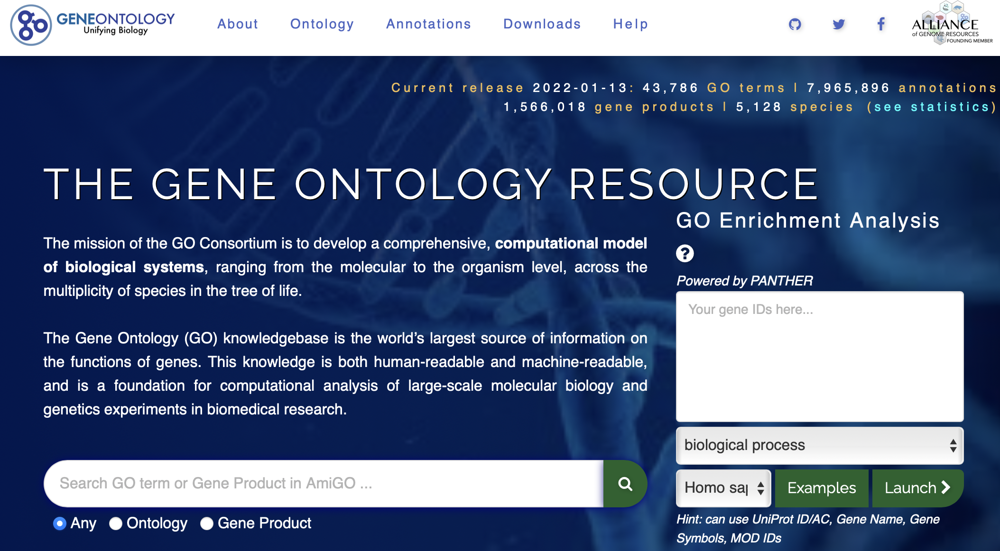

### Gen Ontology API

#### Explored by:


```HU, CHARLOTTE
HU, CHARLOTTE```, ```LAPINSKA, SANDRA```,```WINATA, HELENA KANYA```- ```(Bioinfo 201 - Winter 2022)```



-----


#### Description: 

[The Gene Ontology](http://geneontology.org) develops computational models of biological systems to provide users a thorough representation of the current scientific knowledge about the protein and non-coding RNA molecules produced by genes from different organisms. It’s main use is to support scientific research by answering questions like how individual genes contribute to the biology of an organism at the molecular level or if the organisms share the relevant genes because they inherited them from their common ancestor. It offers two primary resources 

- GO itself which comprises of the logical structure describing the full complexity of the biology, and 
- GO annotations that relate gene product to specific ontology terms to describe its normal biological role.

A list of APIs can be found at [API listing website](http://api.geneontology.org/api). 


#### Use cases:

Finding Genes associated with a GO term - We can use the database to look for genes that are associated with a biological process, mechanism, etc. This is useful to compare between known genes associated with a GO term and a putative gene of interest.
Find all concept related to a particular disease or gene - We can use this API to retrieve the information of a certain disease or gene we are interested in. It will give us an empty array if it is not found. It saves us time from looking for the object we are studying. Moreover, it provides us results with synonym terms that could be used for literature search or other databases.


#### Tutorial: 

[A tutorial on Gene Ontology in Google Colab is available here](https://colab.research.google.com/drive/1xQkpV3FsaMG-r5gEvcXX5dkDhvcfmoMn)
