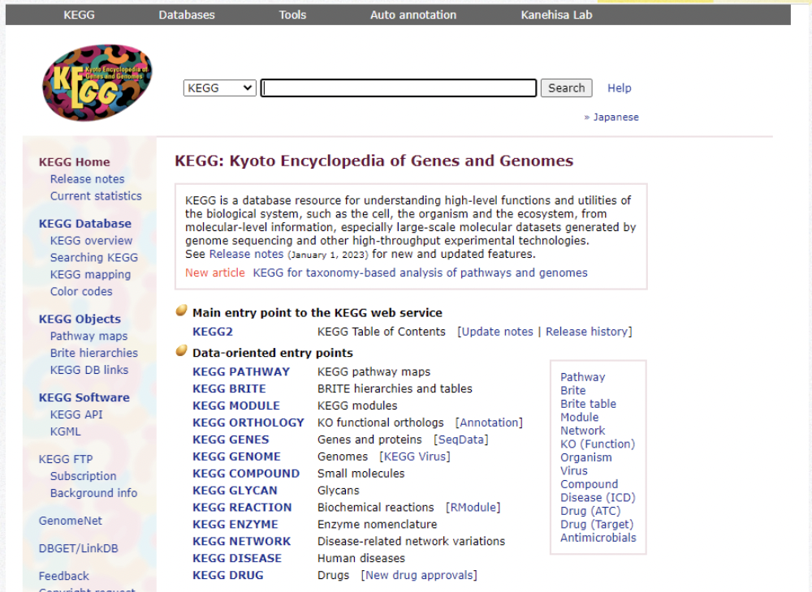

## KEGG API: 

KEGG is a database resource for understanding high-level functions and utilities of the biological system, such as the cell, the organism and the ecosystem, from molecular-level information, especially large-scale molecular datasets generated by genome sequencing and other high-throughput experimental technologies. 

https://www.kegg.jp/kegg/rest/keggapi.html 


Explored by: ```Greta Gerdes, Lena Krockenberger, Ryo Yamamoto```



KEGG API Card: 
https://colab.research.google.com/drive/1B7avw4AQOIBKXh_zz1rCRI78rOVTY0d_#scr ollTo=-7zYiH5ZccsM 

### Task: 

Given some human disease (e.g. insulin resistance), find the metabolic pathways that are involved in this disease using KEGG Pathway (e.g. insulin signaling pathway in muscle cells). Find specific genes within these pathways that could be potential drug targets. Find drugs that target these genes using JTC (Therapeutic Category in Japan) (e.g. Insulin Receptor INSR). 

#### Background: 

You have a specific human disease of interest and want to better understand specific pathways involved in the progression of this disease and identify existing drugs that target integral proteins within these pathways. 

#### Goal: 

Find drugs that target proteins in the disease pathway. 

#### Method: 

1. Pathways: Use the KEGG Pathways API to get pathways involved in the disease of interest (e.g. protein names and cellular localization). Get a list of genes that are potential drug targets. 

2. Drugs: Use Therapeutic Category in Japan through KEGG API to get a list of drugs that target proteins coded by genes in the list created previously. 
Expected outcome: A list of drugs which may play a role in treating this disease. They are drugs that interact with prominent proteins within these pathways. 

### Slides: 

https://docs.google.com/presentation/d/1pKdhI_D2l1XTjee3szsl8UYE0p77ZMyR/edit#sl ide=id.g203e895e617_0_15
