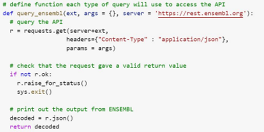
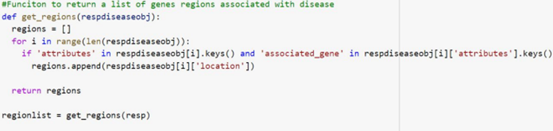
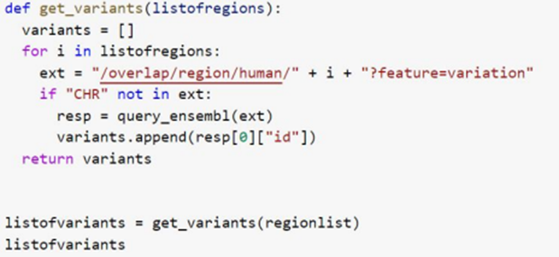
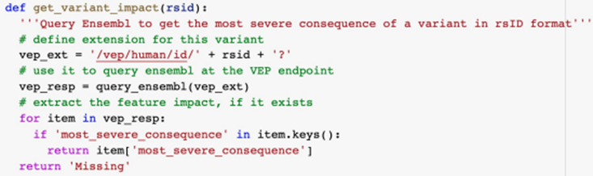
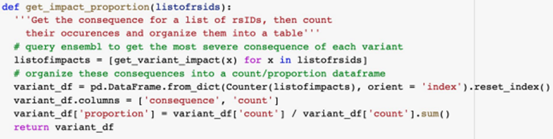
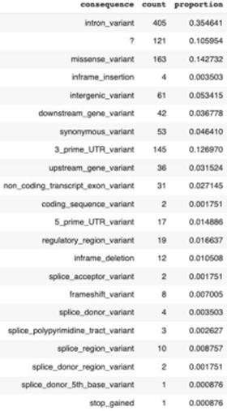

## API-based method retrieves variant consequence proportions for human diseases
#### Explored by: 

```DARCI-MAHER, NICHOLAS WAXTER```, ```RAZMA, CONNOR JOHN```- ```(Bioinfo 201 - Winter 2022)```


### Description
#### Project overview
1. Assume we are given a disease of interest

2. Use the Ensembl phenotype annotation endpoint to extract genomic
regions associated with the disease
3. Use the Ensembl overlap endpoint to find variants in these regions 4.
Use the Ensembl Variant Effect Predictor (VEP) endpoint to discover the
consequences of each variant
5. Calculate the proportions of each consequence for the disease

#### Function to access Ensembl Rest API features
● Input: Extension specifying application
● Output: Object associated with application
● In our case we will use this function to get a list of dictionaries with areas of the genome associated with alzheimer's



#### Function to find gene regions in our list of dictionaries
● Input: List of dictionaries of areas of genome associated with a disease 
● Output: List of gene regions that are associated with a disease



#### Function to return all variants associated with regions 
● Input: A list of regions associated with a disease 
● Output: All variants associated with those regions



#### Use VEP to get variant consequence 

● Input: a single variant ID (rsID) 
● Output: The most severe consequence of that variant (e.g. missense, splice  site, stop gained, etc.)



#### Calculate proportions of consequence in a variant list 

● Input: a list of variant IDs 
● Output: proportion of consequences for the disease associated with the list  of variants



#### Results: Proportion of variant consequences in Alzheimer’s disease 

● Ran our full pipeline on Alzheimer’s  disease (EFO ID=0000249) 
● Found that the most common  
consequences in Alzheimer’s variants are: 
1. Intron variant (35%) 
2. Missense variant (14%) 
3.  3’ UTR variant (13%)

