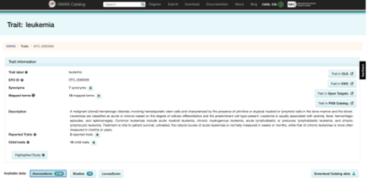
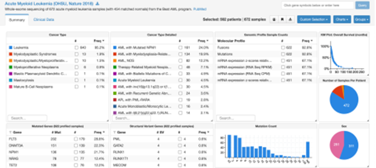

## Integration of GWAS and eQTLs APIs

#### Explored by: 

```PIMPLASKAR, ADITYA```, ```LI, TERENCE WENTAO```, ```KIM, SANDY SUNG```- ```(Bioinfo 201 - Winter 2022)```


### Description:

#### Task:

Given a set of GWAS hits for a cancer like leukemia, retrieved from the GWAS Catalog (through
gwasrapidd querying in R), can we detect genes that are variably expressed? In other words,
can we map these GWAS hits as expression quantitative trait loci (eQTLs) in leukemia cells, or
any other cancer type (queried through cBioPortal)? 

#### Background:

For a particular cancer type, you find a set of associated SNPs and are interested in their
downstream regulation on gene expression. You want to try to track any functional association
of these variants on cancer gene expression pathways. Being able to track these associations
can provide a more thorough view of cancer biology, while also potentially allowing for the
investigation of targeted therapeutics.

#### Goal:

Detect downstream effects of GWAS hits on gene expression in the target cancer EFO trait.

#### Method:

1. GWAS variants: Query the GWAS Catalog with the ‘leukemia’ EFO trait, using the
`get_studies` function to retrieve relevant studies. Extract rsids top significant GWAS hits
from query using the `get_variants` function. These are the variants that we will
investigate as potential eQTLs. We restrict the analysis to cis-eQTLs (variants localized
within the region of the gene).



2. cBioPortal and gene expression analysis: cBio portal houses datasets that have linked mutation and gene expression data. We cross-reference our discovered GWAS hits
against available mutations, and perform eQTL analysis on these mutations with nearby genes. 



#### Expected outcome:

Linked gene and SNP pairs for the target EFO trait and their significance. This may yield insight
into variants that can regulate gene expression.