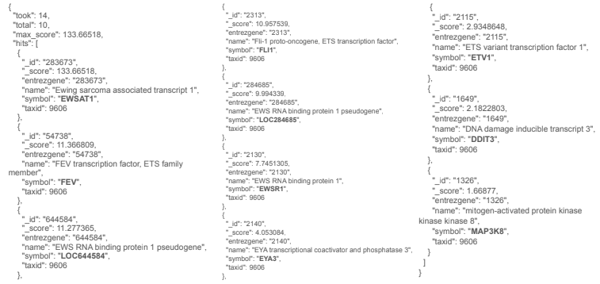
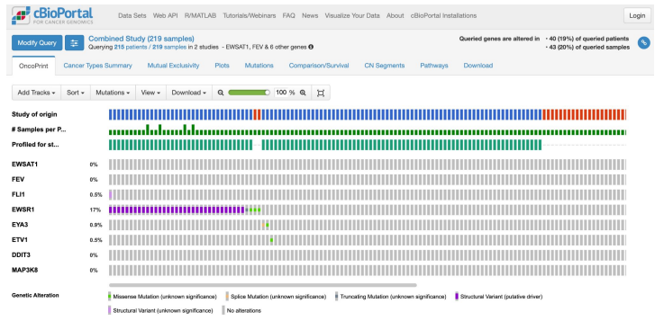
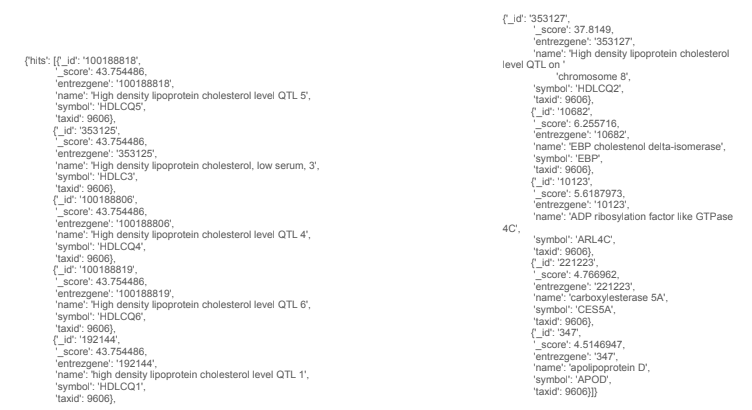
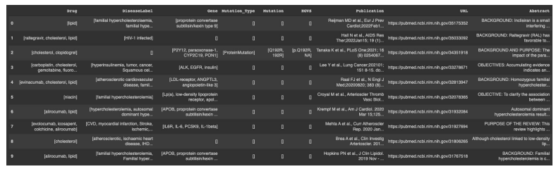

## Integrating Omics DBs (MyGeneInfo-cBioPortal)
### Example 1: Diversity of Ewing Sarcoma driver mutations

#### Explored by: 

```RIDGLEY, TREVOR JAY```,```WANG, HAROLD ZHAOKUN```,```XIANG, MARK```- ```(Bioinformatics 201, Winter-2022, UCLA)```


### Description: 

#### Task: 

Given a query (Ewing Sarcoma), return genes associated with this disease and then search a
collection of patient samples for mutations occurring in those genes.

#### Background: 

Each year, hundreds of children are diagnosed with Ewing Sarcoma in the United States.
The majority of cases are believed to be caused by reciprocal translocation between chr11 & chr22.
[https://medlineplus.gov/genetics/condition/ewing-sarcoma]

#### Goal: 

Understand the landscape of chromosomal rearrangements that lead to Ewing Sarcoma in patients.

#### Method:

1. Obtain a list of genes associated with “Ewing Sarcoma” using the MyGeneInfo Query Service API.
2. Search for mutations occurring in these genes using the Pediatric Ewing Sarcoma database via
cBioPortal API.

#### Expected Outcome: 

A list of point mutations and structural variants found within the target genes of
Ewing Sarcoma patients.

#### Results from step 1:



#### Result from step 2:



### Example 2: 

#### Task:

Given a query (high cholesterol), return genes and protein associated with this disease and then
find the drug and validate that from PMC articles and PubMed abstracts.

#### Background: 

With high cholesterol, you can develop fatty deposits in your blood vessels. Eventually,
these deposits grow, making it difficult for enough blood to flow through your arteries. Sometimes, those
deposits can break suddenly and form a clot that causes a heart attack or stroke.

#### Method:

1. Obtain a list of genes associated with “high cholesterol” using the MyGeneInfo Query Service API.
2. Use PubTator Central (PTC) API to identify drugs and validate form PMC articles and PubMed
abstracts.

#### Expected Outcome: a list of drugs with its targeted genes.

#### Results from step 1:


#### Results from step 2:
