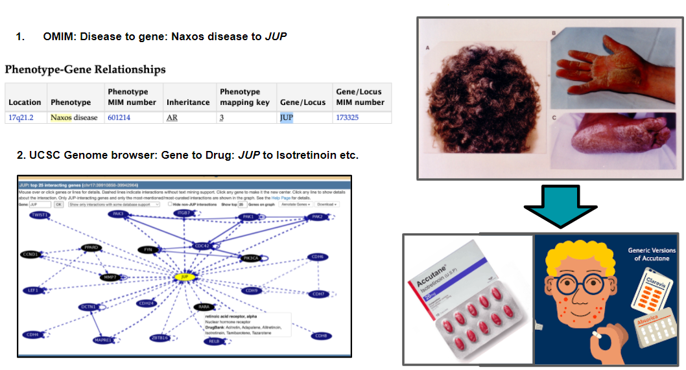

## Drug repurposing suggestions for Mendelian Disorders

#### Explored by:
 ```Boulier, Kristin```, ```GORLA, PURNACHANDRA ADITYA```, ```MUSELLA, FRANCESCO```-```(Bioinformatics 201, Winter-2022, UCLA)```


### Description: 

#### Task: Identify existing drugs that may be effective for monogenic Mendelian disorders

Background: Monogenic Mendelian disorders are often rare diseases with a very small number of patients, making it less appealing for drug companies to develop drugs targeting the disorder due to a smaller potential market and therefore smaller profits. Repurposing existing medications has the potential to bring effective therapies to market much more quickly. Given that these disorders have a single underlying cause, identifying existing drugs with the same or similar molecular targets may be an effective way to identify promising therapies.

#### Goal: Identify existing medications that target Mendelian disease genes or genes that interact with Mendelian disease genes

#### Method: 	
Input: One Mendelian monogenic disorder
Disease to gene: Create an API to communicate with the OMIM database through provided API functionality. This API allows identification of disease → gene associations. 
Gene to Drug: Take gene from step 2 and input gene name to UCSC Genome Browser API. There are many possible types of information you can pull from this API and one option includes gene gene interactions overlaid with drugs that target each gene (both gene of interest and all genes that interact with your gene of interest). Pull all drug names associated with input gene and interacting genes.
Output: list of drugs that may be effective for your original monogenic disorder.


#### Example: Drug repurposing suggestions for Mendelian Disorders



