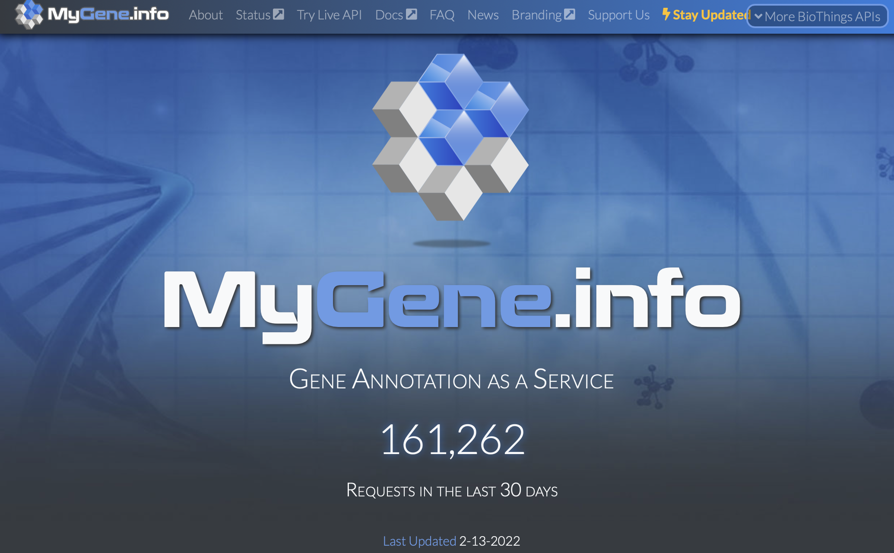

## MyGene.Info API

#### Explored by: 

```RIDGLEY, TREVOR JAY```,```WANG, HAROLD ZHAOKUN```,```XIANG, MARK```- ```(Bioinformatics 201, Winter-2022, UCLA)```


-----



-----


### Description: 

```MyGene.info``` is a web API built with BioThings SDK for accessing gene annotation
information from different sources and integrating that information. There are 2 services: Gene Query &
Gene Annotation. With gene query, genes associated with various conditions such as gene position,
protein and pathways can be found. If the gene of interest is known, then full gene information can be
accessed directly with either their NCBI or EMSEMBL IDs.

### Use Cases:
- **Query genes:** [Query gene query service](https://docs.mygene.info/en/latest/doc/query_service.html) Find genes associated with a protein, organism, genomic interval, name, alias, pathway, gene ontology, etc. Some sample results are below:

    - [http://mygene.info/v3/query?q=symbol:cdk2](http://mygene.info/v3/query?q=symbol:cdk2)
    - [http://mygene.info/v3/query?q=chrX:151,073,054-151,383,976&species:human](http://mygene.info/v3/query?q=chrX:151,073,054-151,383,976&species:human)


- **Annotate genes:** [Anote Gene annotation service](https://docs.mygene.info/en/latest/doc/annotation_service.html) Return aggregated info for a desired gene object using either Entrez (“1017”) or Ensembl (“ENSG00000123374”). Some sample results are below:

    - [http://mygene.info/v3/gene/1017](http://mygene.info/v3/gene/1017)
    - [http://mygene.info/v3/gene/ENSG00000123374](http://mygene.info/v3/gene/ENSG00000123374)

### Tutorial:
- [Tutorial for MyGene.Info in Gogle Colab is available here.](https://colab.research.google.com/drive/1sIAT4ZVg8zB_miOrnUuQH9XwosqnM_T6?usp=sharing#scrollTo=5Co7ypvkPJW8)


