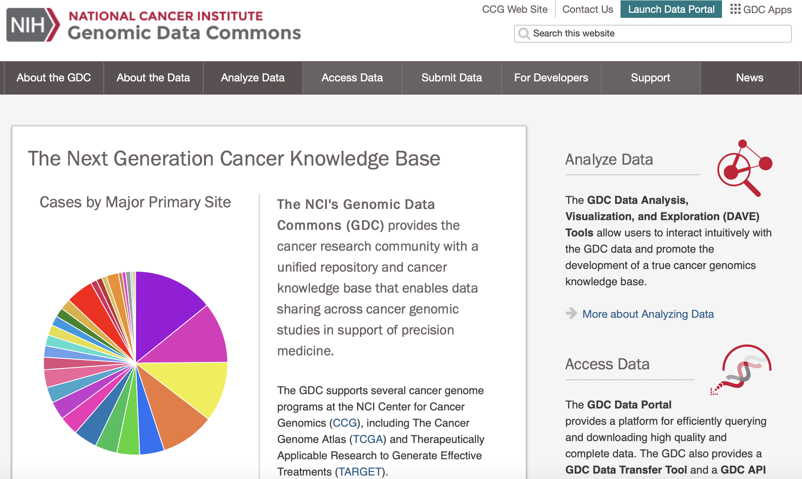

## NIH Genomic Data Commons - (GDC) API

#### Explored by: 

```CHENG, MICHAEL WEN-KAI```, ```OH, JIEUN```, ```YAMAMOTO,RYO```-```(Bioinformatics 201, Winter-2022, UCLA)```

-------



-------

### Description: 

Genomics Data Commons is a database where cancer researchers and bioinformaticians can
download patient data for cancer analysis, including RNA-sequencing, DNA methylation, and ATAC-seq for a variety of cancer types. GDC portal can be accessed directly through this link: [portal.gdc.cancer.gov](https://gdc.cancer.gov).

You can find instructions for how to use two popular API’s here:

-  [GDC command line API](https://docs.gdc.cancer.gov/API/Users_Guide/Getting_Started/)
-  [TCGAbiolinks R package](https://bioconductor.org/packages/release/bioc/htmlTCGAbiolinks.html)

### Use Cases:

- Data Exploration and Retrieval – Gather genomic data from patients of a certain cancer type on the [Repository page](https://portal.gdc.cancer.gov/) or through the above APIs.
- Clinical Comparison – Compare clinical characteristics of specified groups of patients on the [Analysis page](https://portal.gdc.cancer.gov/analysis).

### Tutorial: 

- [Tutorial for NIH Genomic Data Common in Gogle Colab is available here.](https://colab.research.google.com/drive/1YJ_ypFD9mPaLZ2SfQ4QFPnOT9RXjEum4?usp=sharing)
