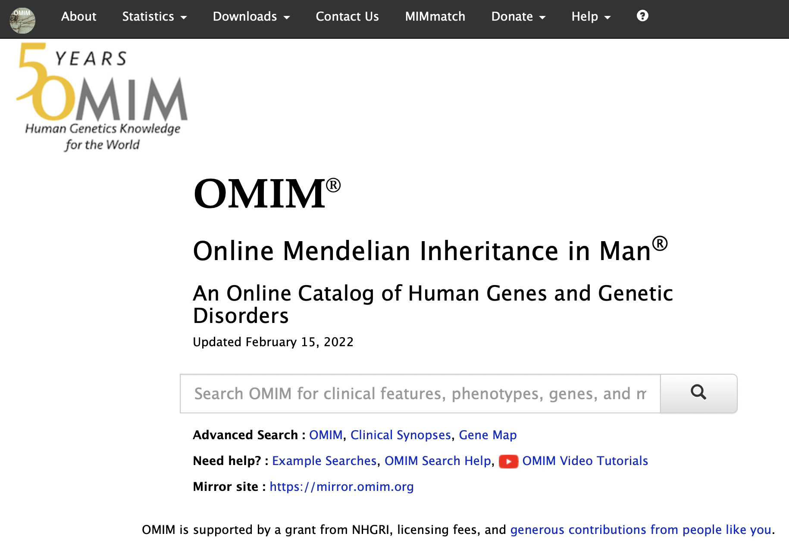

## OMIM API 

#### Explored by:
 ```Boulier, Kristin```, ```GORLA, PURNACHANDRA ADITYA```, ```MUSELLA, FRANCESCO```-```(Bioinformatics 201, Winter-2022, UCLA)```

 -----



-----


### Description: 

OMIM is a comprehensive database of genetic disease phenotypes and genes associated
with disease. Genes and diseases are described with standardized terminology (HPO terms) and with
extensive citations. It is manually curated and maintained by a small group of scientists and clinicians at
Johns Hopkins University lead by Dr. Ada Hamosh. [URL](https://omim.org/) and  [API](https://omim.org/api)

### Use Cases:

1. Quickly find a list of disorders associated with a specific gene and citations
2. find a list of potential diagnosis for a patient with a combination of clinical features
3. Download a list of HPO terms associated with a specific disorder
4. Pull a list of other disorders similar to your disorder of interest

### Tutorial:
- [Tutorial for OMIM API in Google Colab is available here](https://colab.research.google.com/drive/1gbhg5ZAxnW8saTCaS4IBzlaYDijd3Elx?usp=sharing)

