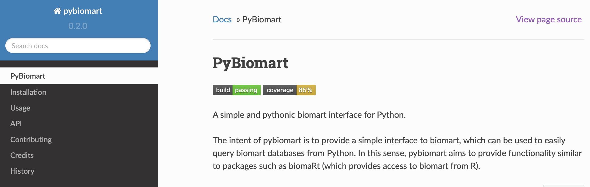

### PyBio-Mart API

#### Explored by:

```HUANG, ELAINE```,```XUE, ALBERT```,```Wei, Angela```- ```(Bioinfo 201 - Winter 2022)```



-----


#### Description: 

PyBiomart allows users to easily query biomart databases (which are publically available biological data repositories, such as Ensembl databases) using Python. PyBiomart allows users to define a flexible range of queries, such as fetching gene lengths and alternate gene names.


#### Use cases:

- RFetch gene start and end positions: Oftentimes, bioinformaticians are interested in the length of a gene. This can be useful to check whether length of a gene is biasing a given analysis. Other times, it is of interest to find a set of length-matched genes to act as a control set in various analyses. We can query the Ensembl databases by specifying that we are interested in the attributes of gene start/end position, as well as transcript length.

- Convert gene names to different ID formats: One of the idosyncracities of bioinformatics research are the compendium of identifiers that can be assigned to a single given gene. For example, each gene has an Ensembl gene ID (in the format ENSG). While Ensembl gene IDs are unique and do not change even if the gene is updated, they are not very informative to the human eye--that is, we are more likely to remember what the FOXP2 gene does, but not very likely to know that its Ensembl gene ID is ENSG00000128573. 

In summary, it is helpful to use different types of gene IDs in different scenarios.
We can also use pybiomart to get alternative gene IDs.


#### Tutorial:  

[Tutorial on PyBio Mart in Google Colab is available here](https://colab.research.google.com/drive/1BGU1uVDXOuiFGjFptEXsIDBHW7ffOVgT?usp=sharing)

