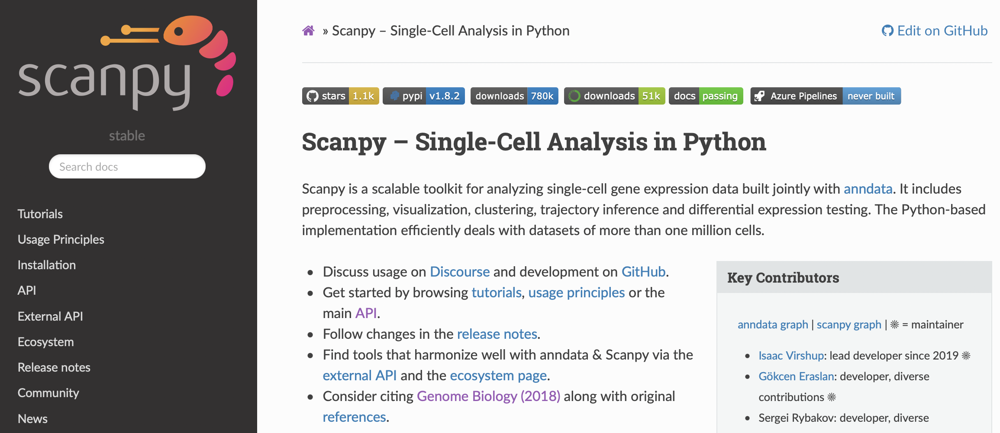

## Scanpy API

####  Explored by: 

```HUANG, HELEN```,```MATTHEWS, JAMIE EMOTO```,```PERRIE, JONATHAN VI```-```(Bioinformatics 201, Winter-2022, UCLA)```

---------



--------

### Description: 

Scanpy is a general purpose API for various components of the single-cell analysis pipeline; these include:

1. Filtering
2. Low-dimensional Embeddings
3. Clustering
4. Marker gene identification
5. Plotting

It can be accessed via the [website documentation](https://scanpy.readthedocs.io/en/stable/api.html), and the original paper can be found on Genome Biology [at this link](https://doi.org/10.1186/s13059-017-1382-0).

### Tutorial: 

we created a simple tutorial covering some of these functions for a scRNA-seq
dataset, which can be accessed [at this link](https://colab.research.google.com/drive/1iwNnEjuJbJ9pyQ9KG7inCQt1LQzlJxTQ?usp=sharing)
.
The tutorial has the following structure:

1. Load data
2. Filter
3. t-SNE vs UMAP computation and plotting
4. Cluster into cell types and plotting
5. Identify genes important for discriminating into groups

### Use cases: 

we present two cases centered around analyzing rare cell types.

1. Task: Given a scRNA-seq data set with rare cell types, identify the marker genes
Background: To better understand rare cell types, we can identify genes that are
distinct in their gene expression profile
Goal: Identify marker genes for rare cell types
Method: API pipeline with some downsampling to balance class sizes
Outcome: Marker genes for rare cell types

2. Task: Given a scRNA-seq data set with rare cell types, construct a trajectory mapping
the relationships between all cell types
Background: To better understand rare cell types, we can look at their ontological
frame with respect to other cell types mapped in some embedding space
Goal: Append rare cell types to lineage tree of more common cell types
Method: API pipeline with a separate projection of rare cell types to embedding after
initial trajectory construction
Outcome: Cell type trajectory
