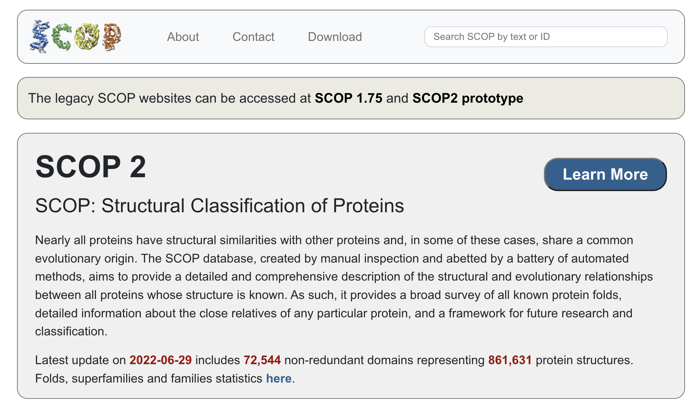

## Task-1 : SCOP API

#### Explored by: 
 
Explored by: ```Joseph Galasso, Yuxing Zhou and Zitian Wang``` 



#### Description: 

[SCOP](https://scop.mrc-lmb.cam.ac.uk/), Structure Classification of Protein, aims to provide comprehensive information on protein structure and the evolutionary relationship between proteins with known structures. Using SCOP, users can easily get the structural information for the protein they are interested in and also get the related protein based on structural similarity. SCOP includes 72544 non-redundant domains representing 861631 protein structures. The users can search their protein of interest based on SCOP ID, PDB ID, or UniProt ID. A brief API instruction from SCOP can be accessed [here](https://scop.mrc-lmb.cam.ac.uk/api). 

#### Use cases: 

Retrieve the structural information of proteins of interest. By entering the SCOP ID, PDB ID, or UniProt ID of a certain protein of interest, users can get a list of comprehensive protein structure information.
Explore proteins with similar structures. SCOP allows users to search for genes with a similar structure to the gene they are interested in. For example, there is a protein of interest for a user. The user can search the structure information of that protein by using the SCOP ID, PDB ID, or UniProt ID. Then, SCOP allows users to search the structure they are interested in, and get a list of proteins with similar structure. 

#### Tutorial: 

[Tutorial for SCOP in Google Colab is available here](https://colab.research.google.com/drive/1jld1aQcwwUbgYabQ9IRgeQNIli-9u6dc#scrollTo=Gm-6V9eWkTGu). 


## Task 2: Integration of RCSB Protein Data Bank (PDB) Search API and Structural Classification of Proteins (SCOP) API 

Explored by: ```Joseph Galasso, Yuxing Zhou and Zitian Wang ```

### Description: 

(1) Task: Given a list of proteins from PDB, determine the structural classification and type of these proteins. 

(2) Background: A list of protein sequences has been generated via wet lab assays that are all probable binding partners to a particular molecule. It would be interesting to determine if these protein binding partners share particular structural features or are related in structure or evolution. This would have utility in helping us understand what an optimal binding partner for the molecule of interest would look like. 

(3) Goal: Given a list of proteins denoted by PDB IDs, use these PDB IDs in a search through SCOP (FA-PDBID field in SCOP) to determine the structural classification of these proteins.

#### Method: 

1. We are given the sequences of the proteins (obtained from wet lab assays) that are probable binding partners. Use the RCSB PDB Search API 
(https://search.rcsb.org/#search-api) to perform a sequence similarity search and obtain the output (use “entry” for return type) PDB ID list. 
2. Map the PDB IDs from the previous step to the FA-PDBID field in SCOP (https://scop.mrc-lmb.cam.ac.uk/) to identify structural classification of these PDB IDs. Specifically, we will use the SCOP FA-PDBREG field, which describes the family domain region in PDB residue numbering. 

#### Expected Outcome: 
A dataframe with each row having a column listing the protein sequence, a column listing mapped PDB ID(s) (output of RCSB API), and a column containing the family domain regions for respective PDB ID(s) in the prior column (output of SCOP API)
