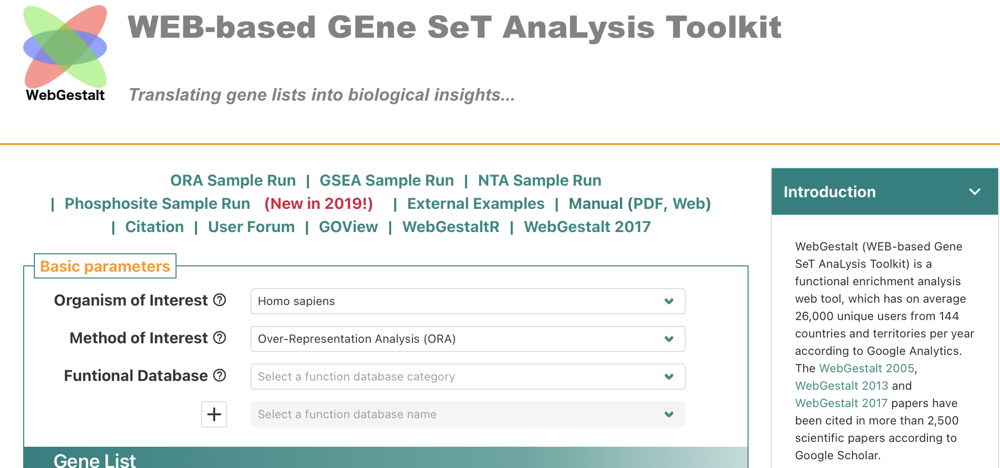

## WebGestalt Web API


#### Explored by: 

```HUANG, HUILING```,```FU, JINGYUAN```-```(Bioinformatics 201, Winter-2022, UCLA)```


-----



-----


### Description: 

WebGestalt is a gene set enrichment analysis tool which helps users interpret lists
of interesting genes or proteins from high-throughput experiment results in various biological contexts. The tool supports three complementary methods for enrichment analysis, including :

- Over-Representation Analysis (ORA)
- Gene Set Enrichment Analysis (GSEA)
- Network Topology-based Analysis (NTA) 

Various functional databases and reference gene sets are available, and users can upload their own choice of reference set. WebGestalt can be accessed directly at [webgestalt.org](http://www.webgestalt.org/), and the user manual of the API is detailed at [WebGestalt 2019 Manual](http://www.webgestalt.org/WebGestalt_2019_Manual.pdf).


### Use cases:

- Retrieve gene set data files of interest (e.g., retrieve the human gene set files in KEGG
database for pathway analysis)
- Retrieve gene set enrichment analysis results (e.g., perform gene set enrichment
analysis of a specific list of genes with specified organism, enrichment method, FDR
method, enrichment database category, enrichment database name, statistically
significant method, significant value, maximum number of genes for a category, ID type
of the gene list and reference set)

### Tutorial:
- [Tutorial for Web Gestalt Web API in Google Colab is available here](https://drive.google.com/file/d/1stWVKXDuqQ8lOquy_HKOSc9j3dW9opZ8/view?usp=sharing)
